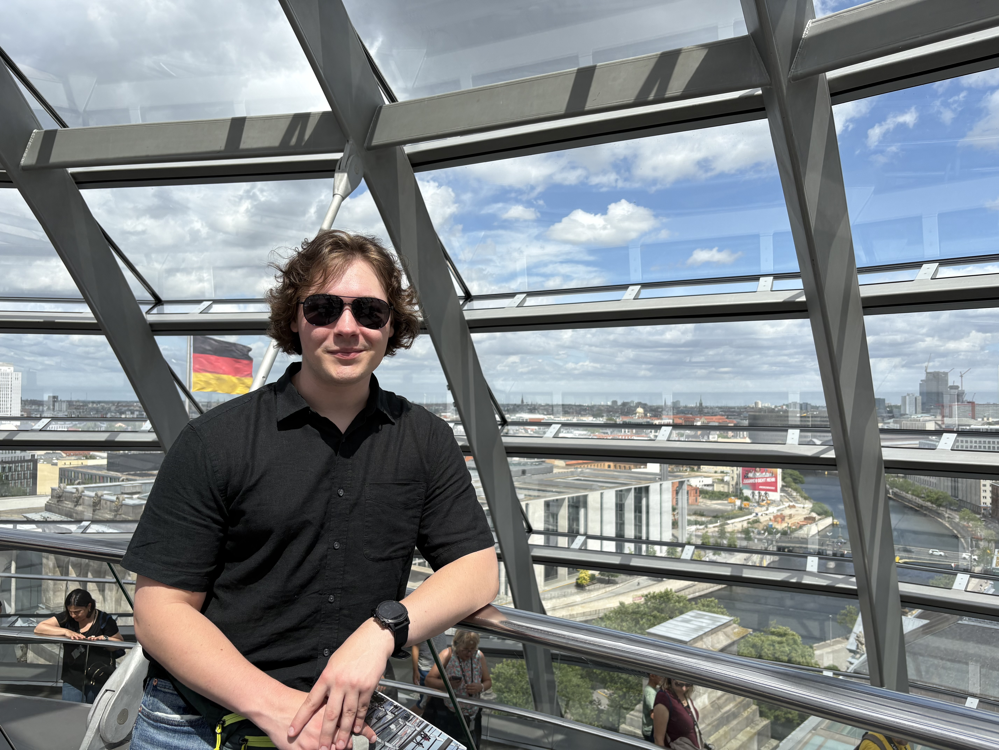

#About Me    
My name is Justin Hatcher, I am in my third year at UNC Charlotte double majoring in Mechanical Engineering and German. I have experience working in Germany as Mechanical Engineering Intern where I was responsible for: Bridging the understanding between ISO and ASME Standards, CAD Modeling, Hardness and element testing for heat-treated steels, and translating technical documentation and specifications.
#
Curiosity brought me to Mechanical Engineering, and the desire to understand how math and science relate to one another. As well as to have an impact for a more efficient and fluid future society. One specific experience that inspired me to study Mechanical Engineering was growing up in Stuttgart, Germany. This area is the epicenter of German automotive engineering and technological advancement within the EU. Companies like Mercedes-Benz, Porsche, and Bosch are always testing their products on the environment around them. Seeing this in real time as a kid as they would test new cars wrapped in a black and white camo that were yet to be revealed being test-driven on public roads intrigued my curiosity exponentially. I knew from that moment I wanted to be a part that of the engineering and innovation that was beneath the surface.  
The engineer I am becoming is an intentionally all-rounded and versatile one. I am doing this by deliberately putting myself in a position to learn to eliminate limitations on my future technical abilities. And even after I am finished with my degree I will want to continue learning and collecting facts to keep my mind fresh and open minded. An engineer with a closed perspective will never find the most optimal solution. 
#
What does it mean to defend an engineering decision : and do you currently know how to do it?
What I believe it means to defend an engineering decision is to know what the technical facts are, it's effects on the environment around it, it's ethical worth, and if the design is fundamentally worth fighting for when challenged. At this point in my academic career, I do not currently know how to do defend an engineering decision properly, but I hope throughout this semester this deficiency will grow exponentially into a critical skill for my engineering career. 
# 
I spent about a week working on this assignment to give myself time to adjust the website periodically and revise text throughly

