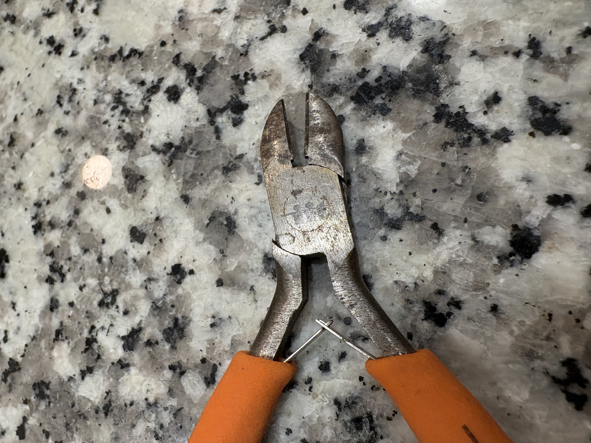
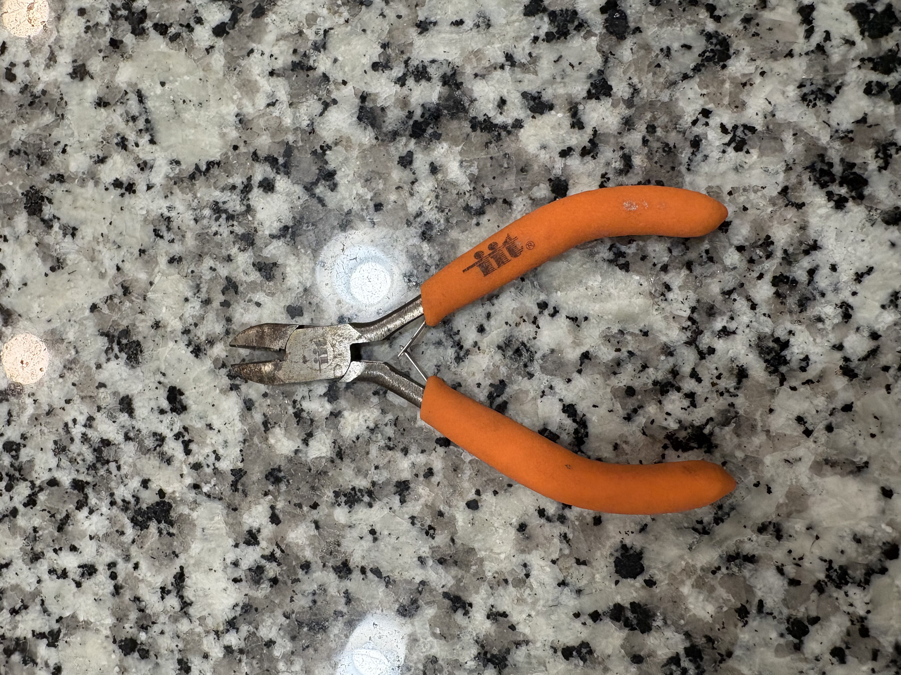
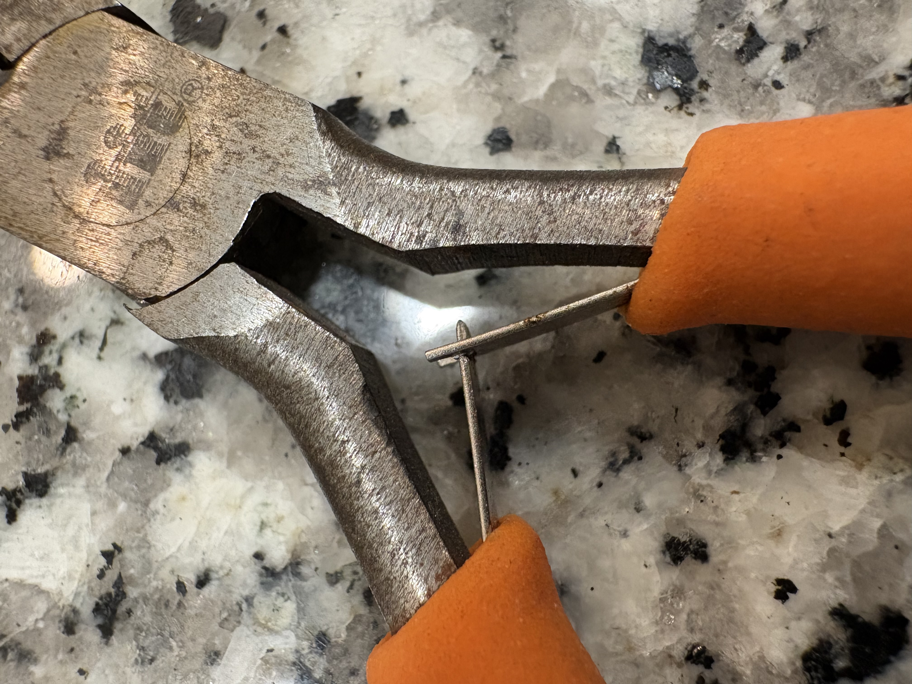
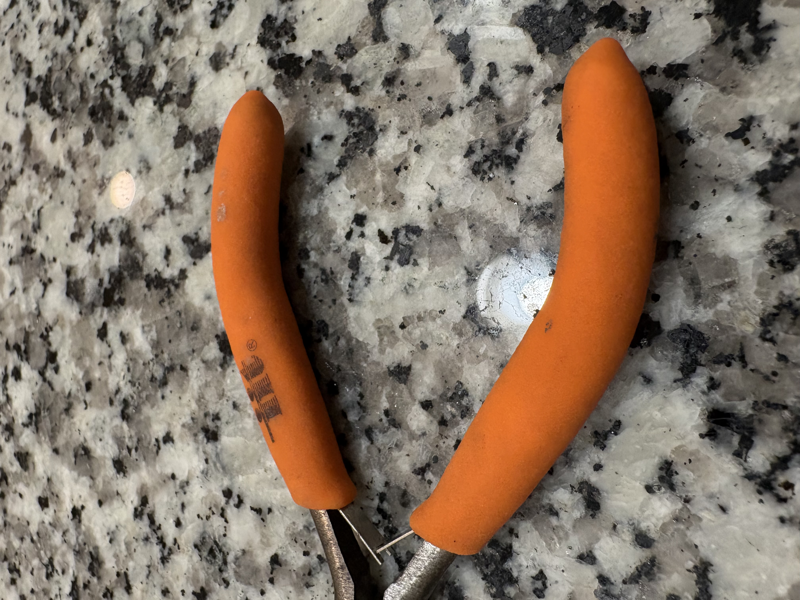

# A1 – [Build Your Professional Portfolio]

## Objective
Firstly, to break down and analyze other engineering portfolios with explicit detail to grasp the full understanding, concept, and perspective of a future user/viewer and how to design as efficient as possible. In this example, a website. Secondly, we were asked to repeat this process with a mechanical device with three or less components. The goal was for us to answer a series of questions about design related to physical principles and engineering functions to discover the intent behind engineering decisions. As well as to think backwards from the complete product to the patent. This allows to understand the complete transparency of the design process, sensibility and challenges that come along with it. 

## Analyze
## Task A: Portfolio Analysis
Github host: https://github.com/eddyizm  

Engineering Portfolio found online: https://thanhvtran.com/  

&nbsp; a.  Navigability : can a reader locate any specific assignment or piece of work in under 60 seconds?  
Github: eddyizm’s Github portfolio has a modular approach with a selective choice of projects/repositories he has developed through Github's services. His staple and highlighted projects are cataloged at the very top of his portfolio in a large section labeled “Pinned”. This section is located in the middle of the screen when clicking on his portfolio. Making it very hard to miss eddyizm’s most prized projects. To search for other projects on his portfolio, one will have to scroll down to the timeline of his work on Github. This can significantly delay the time attempting to find a specific project. Pinned projects can be located in under 60 seconds, but other projects may vary. 
Engineering Portfolio: Thanh Tran’s engineering portfolio streamlines the function of searching for any specific assignment or piece of work in under 60 seconds by strategically placing a projects tab at the very top of his page. Moving to his project page, the user is able to use a filter to select specific projects he had worked on at different time periods. For example; an internship or for a school design project. The website has simple intuitive navigation with bold letters and no clutter. One can find any specific assignment or piece of work that Thanh Tran took part in successfully in under 60 seconds.

 &nbsp; b.  Reproducibility : does the documentation contain enough information that a colleague could reproduce the work without asking a question?  
Github: Eddyizm’s portfolio for his most popular application “Tempus” is completely open to the public on Github. Someone who is experienced with coding could easily replicate the code and adjust the features to their individual needs without asking a question. Each project is self-contained, separated in an easy to read folder explicitly stating the functions of granular code used throughout the website and how it's divided up.  
Engineering Portfolio: The explicit details of Thanh Tran’s engineering portfolio needed for a colleague to replicate the work without asking a question is not possible with his portfolio. The purpose of his portfolio is to showcase his projects, achievements, career timeline, and information about him. When looking at Thanh Tran’s projects, information about the project is kept short and concise. He provides photos of his designs and product for visual context, but he lacks explicitly detailed documentation for a colleague to reproduce his work without asking a question. 

 &nbsp; c.  Evidence of reasoning : does the portfolio show how decisions were made, or only what the final answer was?  
Github: Eddyizm’s portfolio does not show how decisions were made for the design of his app. It is very obvious only the final answer is provided. He only provides application update information for new features, otherwise detailed decision making about which alternatives he should take to execute a specific task is absent.  
Engineering Portfolio: Thanh Tran’s portfolio shows how decisions were made concisely and his reasoning for why he chose his design. He also provides evidence of the final project/answer and the requisite steps needed to complete his design and vision. He does this by stating his vision and reasoning for design, and then further elaborating on his design choices versus his alternatives he had.

 &nbsp; d.  Professional tone : does the language meet the standard of a document you would hand to an employer?  
Github: Eddyizm’s language meets the standard of what you would hand to an employer, although his portfolio is a display of his coding projects. His timeline located under his pinned projects would be a more accurate representation of his writing capabilities. Language on updates and apps is clear and concise to a user that is looking for specific data within his platforms. This is measured with a feedback box located in the menu of the application.  
Engineering Portfolio: Thanh Tran’s engineering portfolio language absolutely meets the standard of a document one would hand to an employer. The purpose of this website is obvious addition to his resume, and to have an accessible portfolio for anyone interested to access. Language used on his projects is a short summary, highlighting key topics and skills utilized during his experiences. For a busy recruiting agent that is looking to save time reading resumes and trying to visual experience, this website is a great place to find specific information about Thanh Tran’s in a short amount of time. 

## Task B: Product Analysis: Cutting Pliers
&nbsp; a.   What is the primary function of this product? State it as an engineering function : what mechanical task does it perform? State it precisely, not as a consumer description.  
To make clean, flat cuts close to a surface. The perpendicular cutting edge allows users to snip wires, nails, rivets or protruding plastic pins flush against a base with the handles getting in the way.  

&nbsp; b.  Identify the governing model : what equation or physical principle governs its primary behavior? 
i.  State the model and identify its variables.  
Governing model: Law of the lever (Class 1 lever), and mechanical advantage.  
Governing equation: Force input x Distance input = Force output x Distance output  
ii.  State one assumption that makes the model valid for this product.  
Grips are curved and made with a strong piece of steel. They are additionally reinforced with rubber grips to maximize strength used on cutting pliers  

&nbsp; c.  Take photographs of each component. Under each photograph, describe precisely how the geometry of that component affects its mechanical function.   
 Fulcrum/Pivot Point: The geometry of this component provides the support to keep the two handles together and keep the pivot distance between the bite point short. This maximizes hand force from the handles.  

: Handles cross diagonally over pivot point allowing for maximum leverage and mechanical advantage. Additionally reinforced with grips to help the user hold the device whilst cutting through material. It is mechanically more ergonomic for the human hand to squeeze a fist, rather than pull apart with two hands if the handle design was closed. This geometry is ideal for its purpose.  

: These interlocking plates contribute additional force to keep the handles stable and in place during cutting, but also the elasticity to bounce back to its neutral position after use. This keeps the grips and handles steady and resistant. Design and geometry for these do not need to be greatly complex. A simple interlocking rectangle does the job.  

: Pliers are equipped with a long biting surface perfect for stability when cutting, having a thick enough blade to cut through rubber and copper (like a wire). The geometry needed to be ideal for its case, if the blade was longer the plier could potentially not deliver as much power equally throughout the cutting surface. Distance to pivot point is short to maximize mechanical advantage and force from grips.  

&nbsp; d.  Using patent research, identify the patent number and author(s).  

 

## Decide

## Communicate  
Check out my About me section! Located in the menu. 
