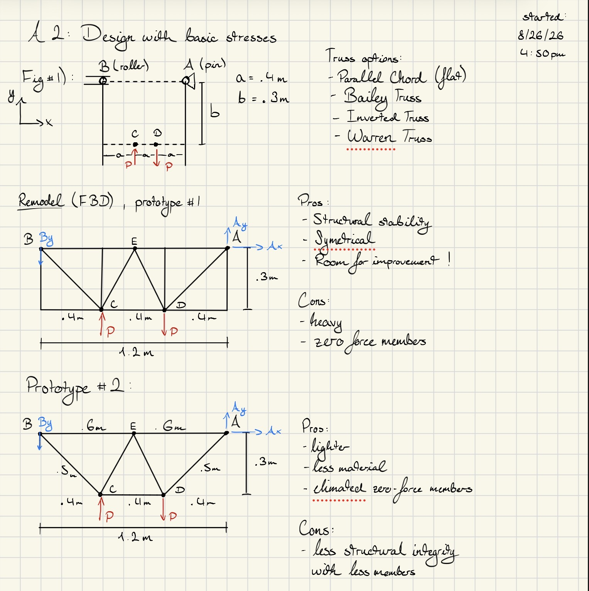
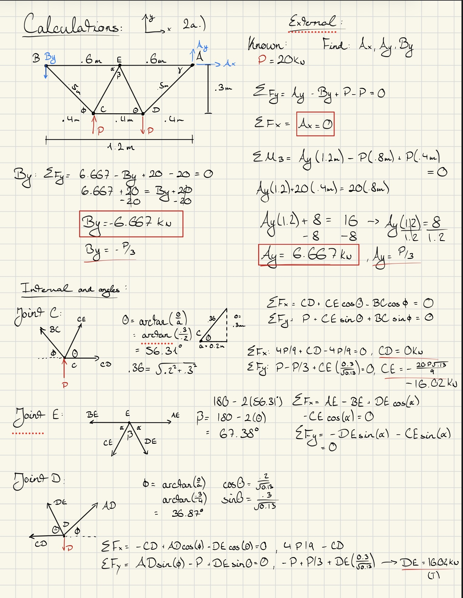
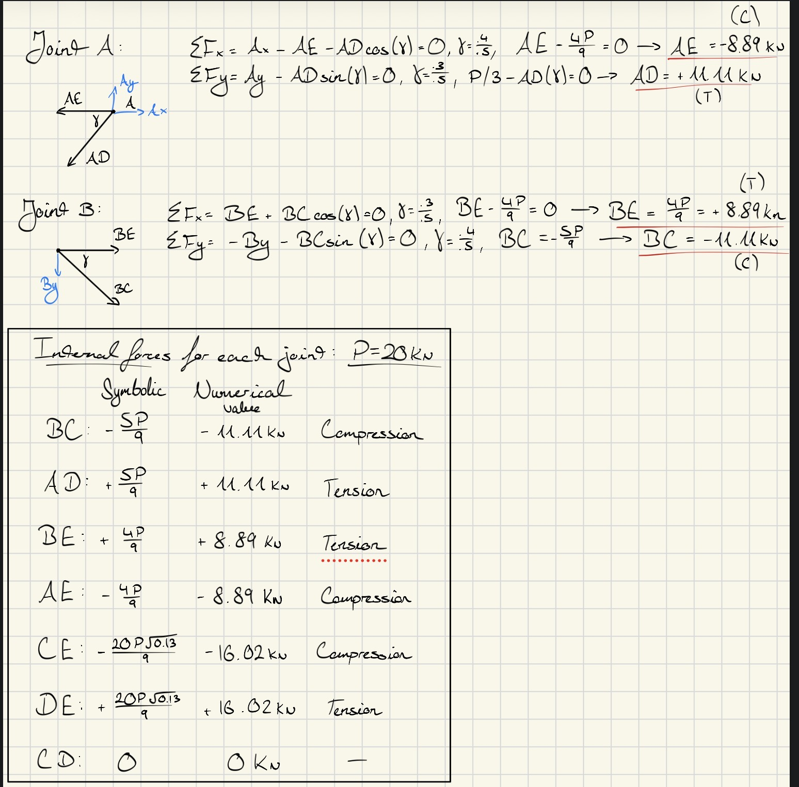
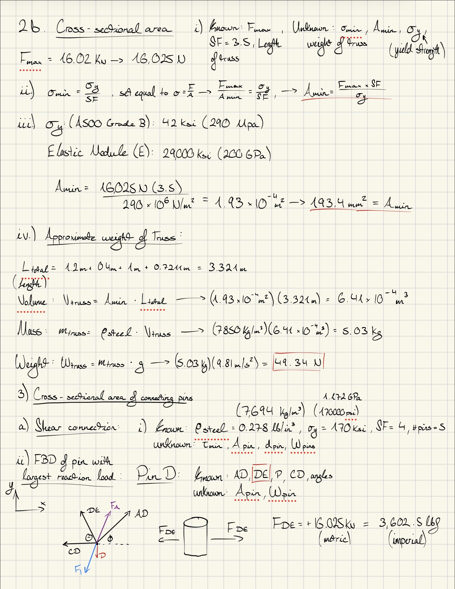
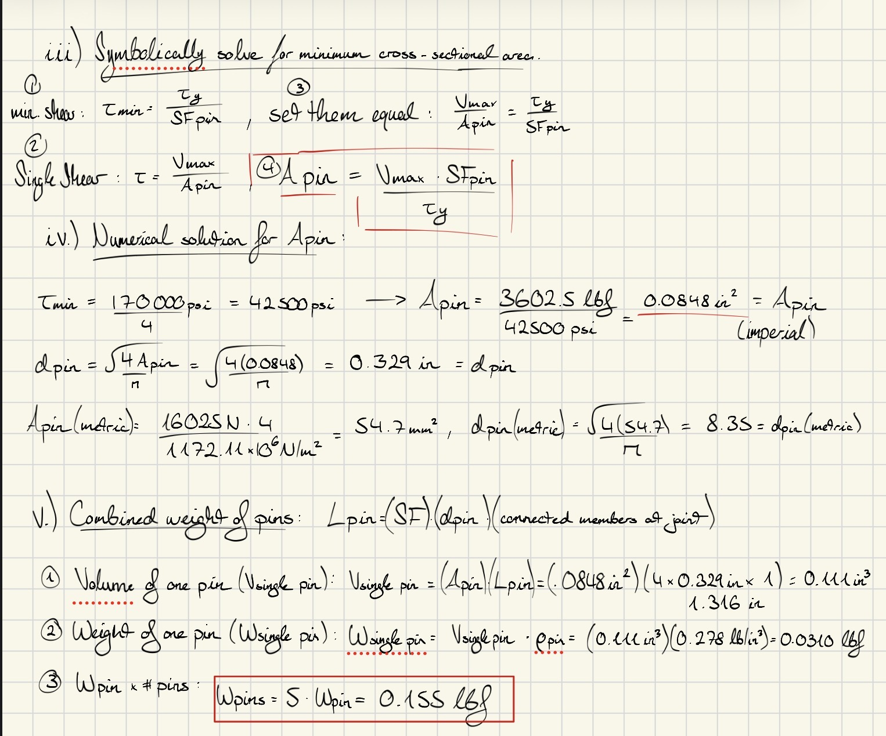
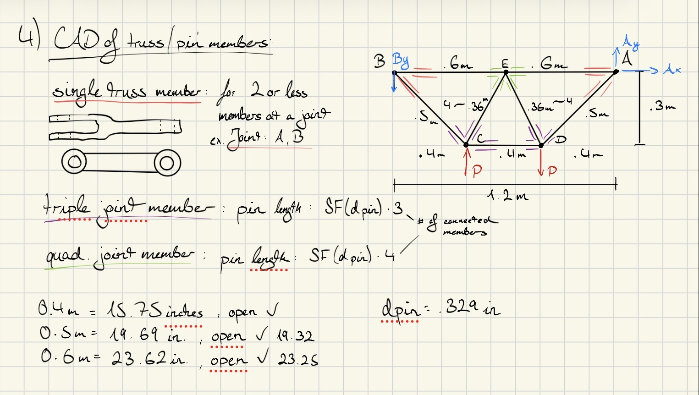

# A2 – Truss Stress Analysis

## **Objective**
The objective of this assignment was to design our own light weight planar truss using A500 structural steel or a similar steel with the same density. We were required to reinforce our design by taking the necessary engineering steps to calculate all the variables (symbolically and numerically) of our system based on our previous knowledge of stresses and strains. Secondly, model our truss in a CAD software to verify the analytical calculations we had done before modeling our truss. And finally, we are supposed to upload our workflow to our online portfolio with a detailed description of the steps and mistakes taken in each section.  

## **Analyze** 
## Design of Truss Geometry      

When presented the problem with designing a truss, my first immediate instinct was to search for real life examples of similar truss systems. With simplicity and weight saving in mind, I initially opted for a flat rectangular parallel chord as it seemed it would be the most structurally stable and symmetrical.  
After drawing my prototype, I realized that my system was not optimized enough for the task at hand. I listed out my pros and cons of this design and started drawing prototype 2 which would eventually become my final design. I took inspiration from Warren Truss and inverted the design to adapt to the constraints. By doing this, my top chord would completely span parallel across to the other edge, as if cars or people were walking across this “bridge”.  

## Calculations of Truss  
  
  
The largest internal force I calculated on my truss was member DE in tension at +16.02kN. After identifying this member I created a list of knowns and unknowns to properly categorize what variables I needed to solve for based on the information I was already given. I solved for the minimum cross-sectional area symbolically first by using the yield strength, largest internal force, and Safety factor. Setting them equal, one can isolate the minimum area on the left side of the equation to solve for it. I properly followed this by plugging in the numbers into my equation to calculate the minimum cross sectional area in metric units and imperial units.  
To approximate the weight of the truss, I first solved for the total perimeter of the truss, which gave me a variable to use in my volume calculation, which then led to me being able to the use density given to solve for the mass, and lastly multiplying it with the gravitational constant to reach the sum of the weight. 

## Calculations of Pin and Shear  
  
  
Firstly, I started with listing my known and unknown quantities that I could substitute in my shear equations to find the exact values I wanted. Values I was looking for were, the allowable shear, cross sectional area of the pin, diameter of the pin, and the weight of the pins. Similarly to the last section, the equations built on one another allowed me to find all the variables required for this assignment. Secondly, I drew two Free body diagrams, one with a point and the other of a cylinder to represent the pin and arrows to represent the maximum load on the pin from internal forces. I determined the approximate combined weight of the pins was 0.155lbf, since we were given imperial metrics values for density.  

## Design in Solidworks  
  
<object data="A2_truss_screenshots.pdf" type="application/pdf" width="100%" height="800px">
    
Your browser does not support inline PDFs. <a href="A2_truss_screenshots.pdf">Click here to view or download the A2 truss screenshots PDF</a>.

</object>
To generate a 3D model of my designed Truss I chose Solidworks since it is the CAD program I have the most experience with that is immediately accessible to me right now. Otherwise I would have used Siemens Solid Edge. After a brief introductory period familiarizing myself with the layout and UI of tools I was ready to begin modeling.  
I started off modeling my first prototype for my members that was a simple double closed ended member. Taking inspiration from a closed end hand wrench, I figured this would be a good starting point.  
After a little bit, I began to evaluate my design because of the process during assembly. My truss members would not be perfectly aligned with one another but stacked besides each other, especially at joints with more than 2 jointed members.  
This is where I redesigned my truss members with an open ended design like fork, where closed ended members could be joined with a pin between the two prongs. This way I only have to make one type of truss member and just change the length to hold to my design intentions. This worked great because I could join all the members together like a chain.  
After putting my members together in assembly, I evaluated the mass properties given by Solidworks. Having selected the correct material I was excited to see how this would compare to calculations I did before modeling together on CAD. The results were impressive, I ended up achieving a Safety Factor of 4.8 which far exceeded the set standard for 3.5. On the other hand, my truss weighs 4 more lbs than calculated, but the rule of thumb is that CAD calculated weight is always more than real world weight.  

## **Decide**  
 Prototype 2 weighed less than prototype 1 by eliminating zero force members, and unneeded members. Less joints, and less materials means less points of failure. I chose this geometric shape because in structural design the triangle is the strong geometric shape. To be able utilize this shape across my whole truss insured me it would be structurally stable enough to meet the safety requirements and design constraints.  
Finally, I was able to go through my calculations and solve for external and internal forces symbolically and numerically by using the method of joints to provide an in-depth Free body diagram of my truss analyzed at each point.  

## **Communicate**
My engineering lesson learned with this assignment was being able to reevaluate at any step and start back over and test ideas because this is the only way one comes to the most optimal solution. I also learned about different truss designs and their purposes, as well as what materials are commonly used to efficiently optimize yield strength whilst comparing the external stress of a load or loads. For example like in this assignment where two external forces are counter acting on different parts of the truss. It took me over the course of the week to finish this assignment. Around 20 hours were spent on this assignment. This includes revisions of work, uploaded assignments, updating my portfolio, and assmebling my CAD parts and files.  

## Link to finish CAD product:  
<a href="_assembly.zip" download>Download SolidWorks Assembly</a>  
PDF File:  <object data="asmb2_w_joints_A2_Sodesign.pdf" type="application/pdf" width="100%" height="800px">
    
Your browser does not support inline PDFs. <a href="asmb2_w_joints_A2_Sodesign.pdf">Click here to view or download the A2 truss screenshots PDF</a>.

</object>  
