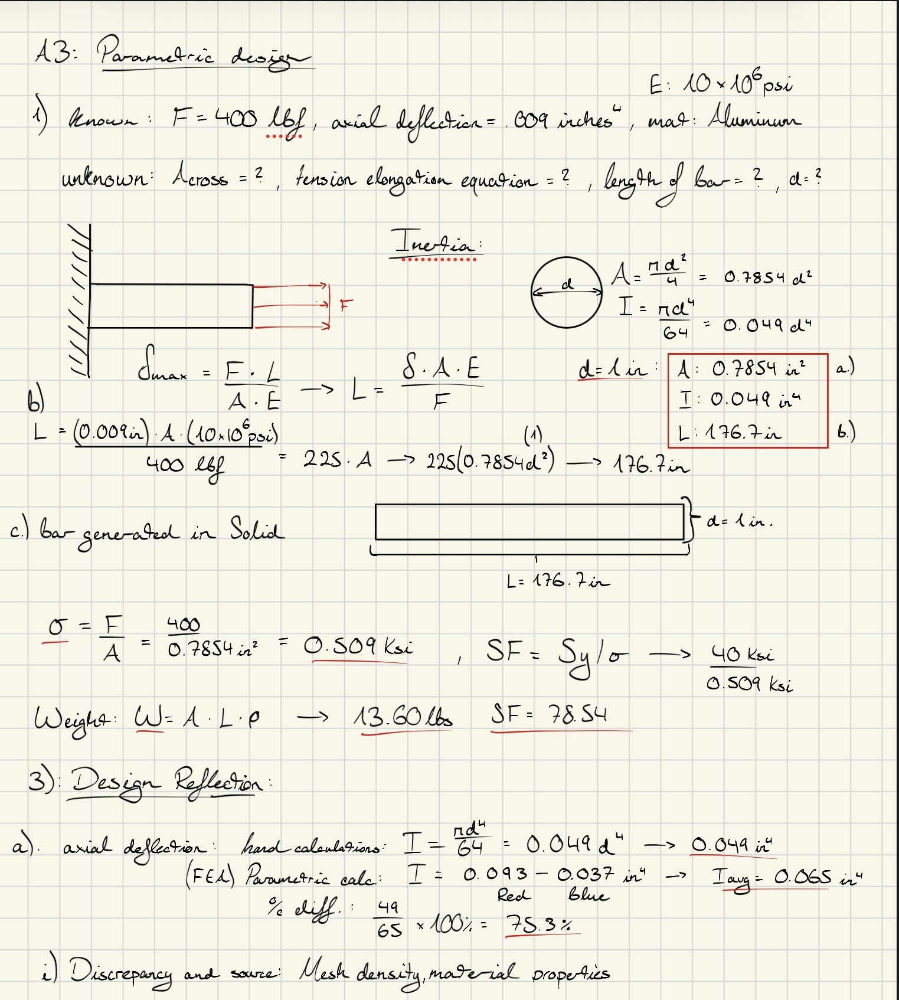
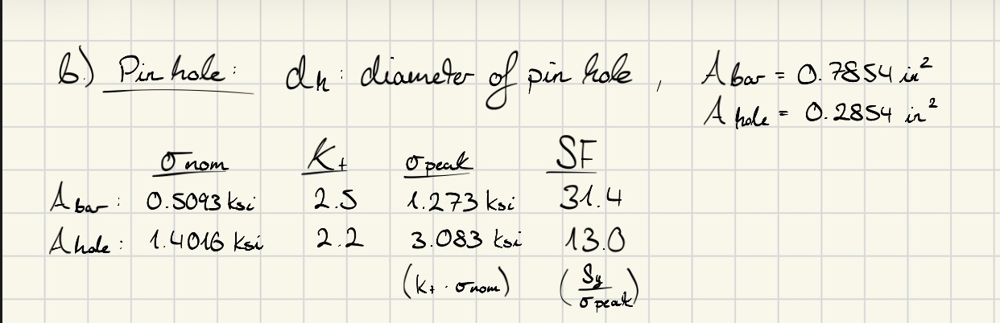

# A3 – [Topic]

## **Objective**  
We were asked to design a bar which has a circular cross section where the values of the criteria given for the material, maximum deflection and load. Determine the bar’s minimum geometry (ie.. length, diameter, and weight) through parametric design while under direct tension. Then verify the geometry through finite element analysis. Our goals were to use axial deflection modeling to design its dimensions, use parametric design to determine a bars length, an introduction to FEA as well as linking dimensions to appropriate CAD parameters, and finally compare and contrast the different analysis.  

## **Analyze**
## Parametric Design  
  
  

## **Decide**  
I would trust the hand calculations more than a CAD model simulation because the hand calculations are given off single values and give a foundation and guide towards a parametric design. The CAD simulation should be used as a visualization tool and analyze and verify that your hand calculations are correct and accurately represent what one is trying to design.    

## **Communicate**
Some lessons learned while working on this assignment was learning how to run an FEA test in Solidworks with parameters set in the equation tab. I also learned how to evaluate these properties and compare them with calculations by hand, and FEA calculations in Solidworks. I started this assignment Wednesday and completed my final revisions Monday. The total time I worked on this assignment was around 8 hours.  
