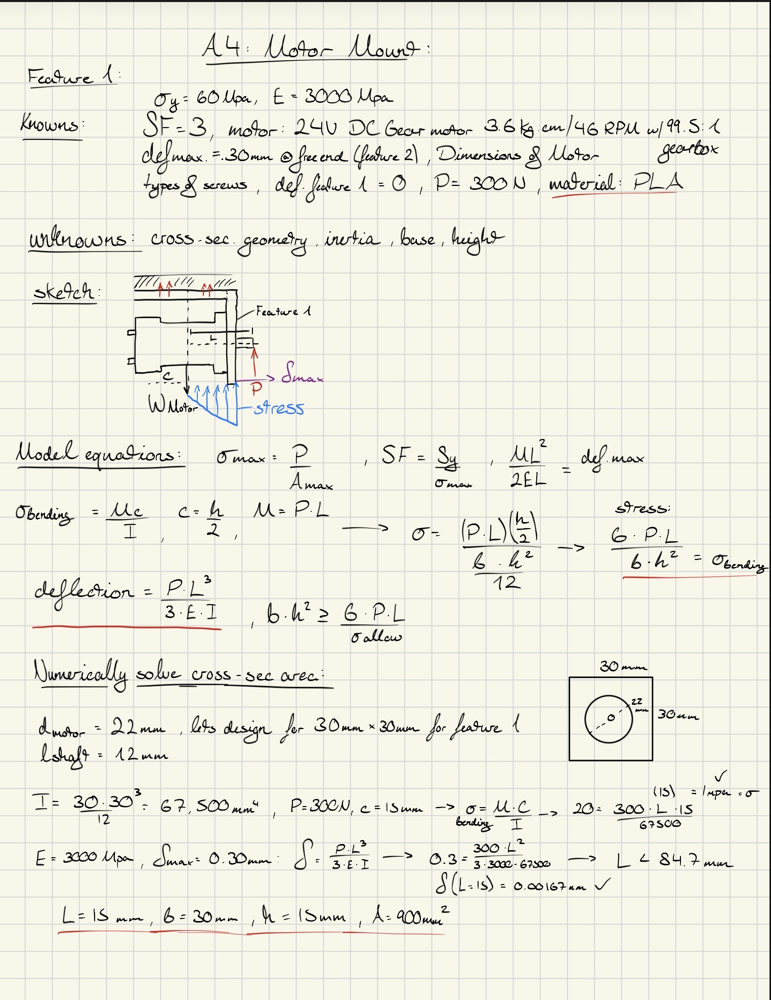
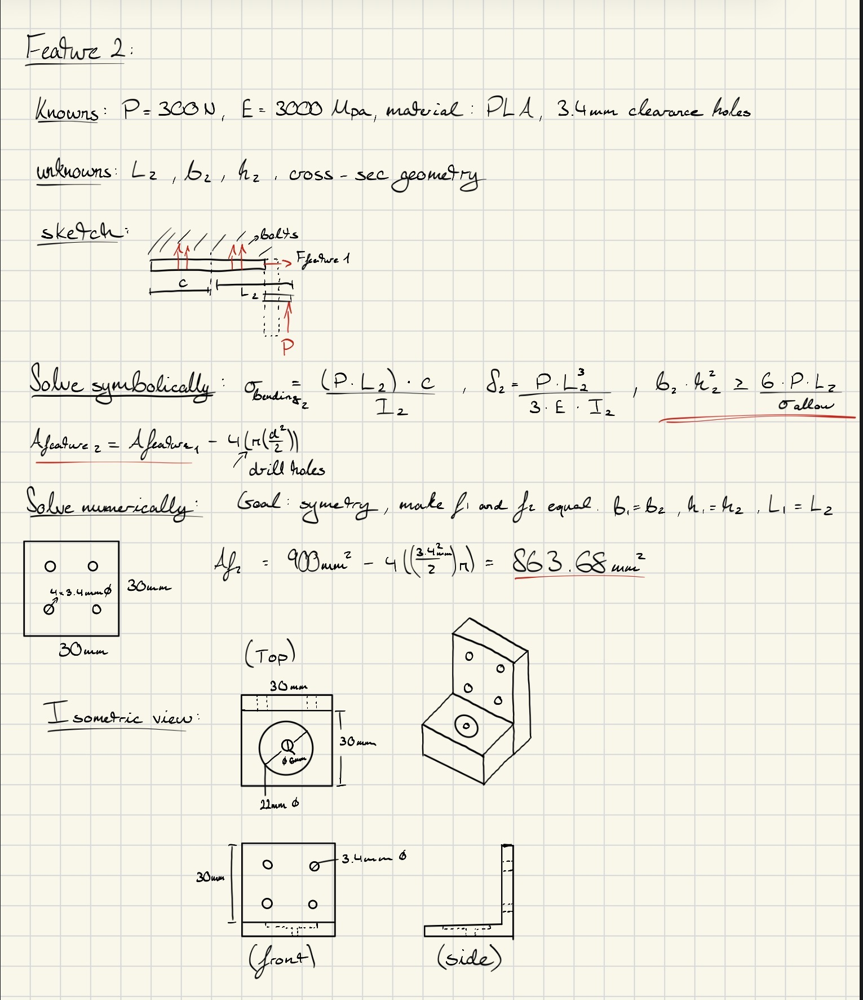

# A4 – Motor Mount

## **Objective**    
The objective of this assignment was for us obtain working knowledge by designing a motor mount where we will solve for stress and deflection with beam calculations. We are asked to use Brushed 24V DC Gear Motor 3.6Kg.cm/46RPM w/ 99.5:1 Planetary Gearbox which attaches to a rigid wall, where the mount is to be made from one of three different materials with a safety factor of 3. Lastly, we are asked to research different types of motor mounts and link them in our appendix at the bottom along with our CAD modeling process for our individual parametric design. If you are curious about my design process, check out my feature 1 and 2 above.  

## **Analyze**  
## Feature 1  
  

## Feature 2  
  

## Sketch  
You can find my isometric view, and free body diagrams within my work on features 1 and 2 above.  

## CAD Model (Parametric)  
Here are screenshots of my design process during the CAD modeling part of this assignment. In this embedded pdf you can find the paths I took when 3D modelling this motor mount and converting it from my sketch into a physical one piece part.  
<object data="A4_CAD_screenshots.pdf" type="application/pdf" width="100%" height="800px">
    
Your browser does not support inline PDFs. <a href="A4_CAD_screenshots.pdf">Click here to view or download the A3 parametric design screenshots PDF</a>.

</object>  

Link to Solidworks Part A4: Motor Mount:  
<a href="A3_FEA_beam.SLDPRT" download>Download SolidWorks Part</a>  

## **Decide**  
My very first step during this design process was to analyze the guidelines step by step in-depth to get a full grasp of what it is I have to accomplish and show with this assignment. After this, I began to look at the motors dimensions were, and how this motor could be used. I felt the purpose of this particular motor dictates and guides the process of parametric design further step by step rather than just making a motor mount that is screwed into a wall with aimless direction. Having a good idea on where I should start, I went ahead with my calculations and drawing out potential prototypes for my dimensions of cross-sectional area of my motor mount.  

Towards the end of the assignment we were asked to research a motor mount of similar parameters and purpose and showcase it on our website.  
I took inspiration from this public CAD design that had a similar "L" shaped bracket like mine. But again, because of purpose his screw holes and bracket mount were very different from my design.  
Link to part: https://grabcad.com/library/nema-17-motor-mount-1  

## **Communicate**  
A lesson I learned during this project was the value of symbolically solving for variables with no numbers or values. At first, I struggled to create formulas on my own, not understanding why we can't just plug in numbers and get the answer. Little did I know the truth to engineering lied much deeper than that. Writing formulas from scratch is the opus of designing parametric modeling and having the flexibility to adjust values when needed based on different parameters, like factor of safety or stiffness. Having the foundation equation for what you are designing for and being able to manipulate it feels very satisfying once one is able to do it correctly with a successful model as the outcome. All in all this assignment took me about 9 hours spread out over the course of multiple days. 
