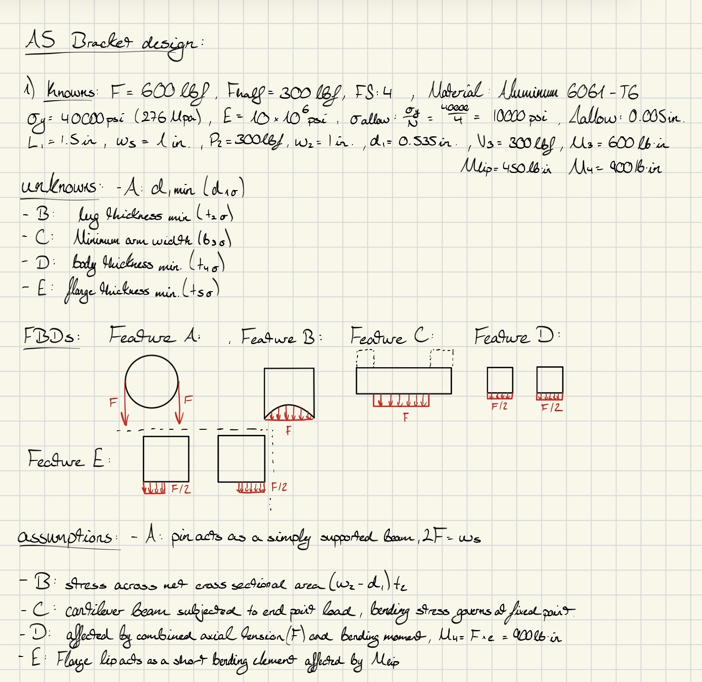
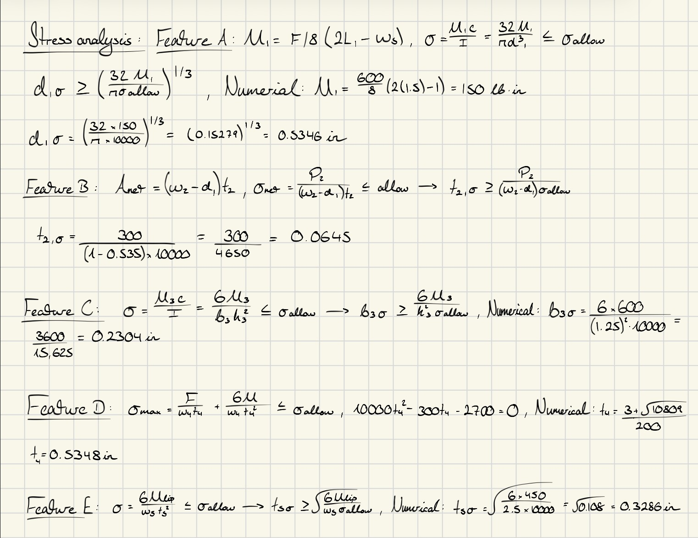
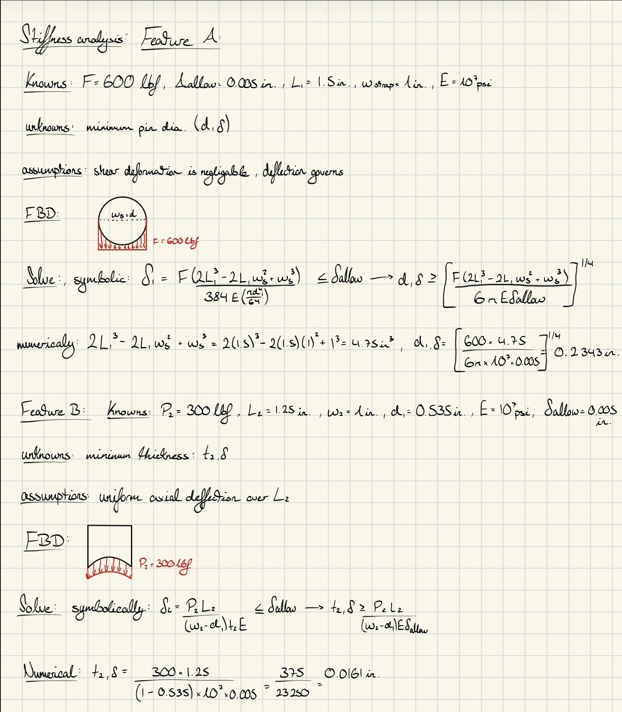
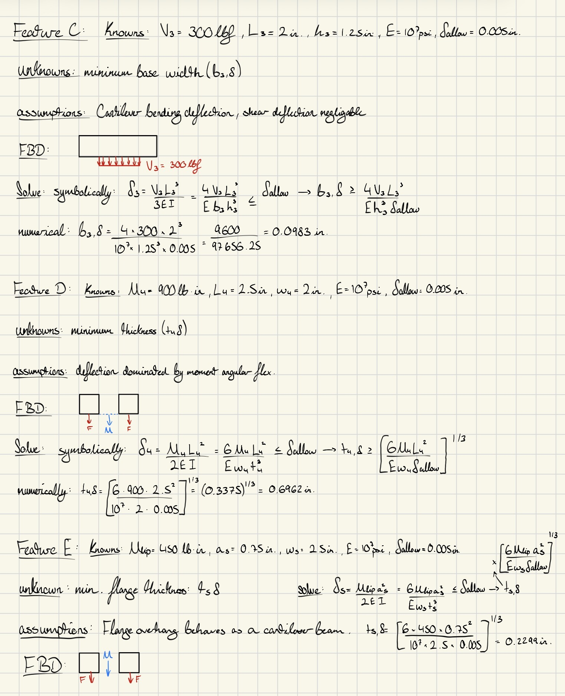
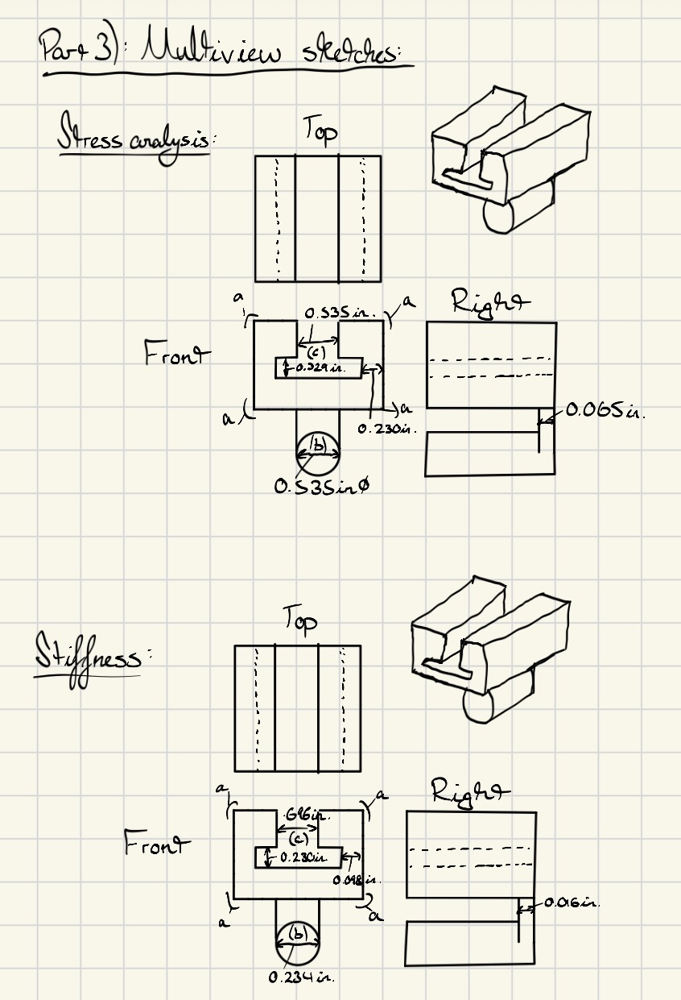

# A5 – Bracket Design

## **Objective**  
The objective of this assignment is to design a bracket using the concept design given in Appendix A to hold a horizontal force applied symmetrically by a strap outline in resource #1. The bracket’s dimensions are designed with different fit classes. Each dimension of the T beam is part of the fit:  
“a” intention for use where accuracy is not essential  
“b” is about the closest fits that can be expected to run freely  
“c” is where accurate location and minimum play is desired  
We are asked to design with parameters of a Safety Factor of 4 and an applied load in-between 500 - 800lbf, made from a metal of our choice. Also being asked to conduct stress analysis to determine structural features, Generate FBDs to visualize forces for each feature, Identify known and unknown variables, Perform elasticity analysis and establish deflection constraints, compare stress and elasticity, provide Multiview sketches, and reflect on the assignment and any key engineering lessons learned.  

## **Analyze**  
## Calculating Dimensions from stress analysis  
  
  
## Calculating Dimensions from stiffness analysis  
  
  
## Generate Multiview Sketches  
  
## **Decide**
For my personal assumptions and factors given the range of materials and forces, I opted for Aluminum 6061-T6 because it yields a high strength perfect for our given safety factor to give me more flexibility when finding a range for my dimensions, and additionally it also has a higher modulus of elasticity than the rest of the materials provided in the instructions. Secondly, I chose 600 lbf because it was an even number and because we have a symmetric part the values of the forces would be evenly distributed. Additionally, it was lighter than 800 which would also give me more wiggle room when designing dimensions that fit the parameters provided in the instructions.  

## **Communicate**  
## Lessons Learned  
Governing Failure Mode:  
Comparing Feature A’s dimensions governed by stress and stiffness were vastly different. For stress, the value was nearly double that of the stiffness. I would absolutely use a thicker round feature for my bracket because the material is softer as well as adding an additional factor of safety on top of the already provided base line. A product can not be too safe if it's justified. Additionally, a major on the weight enters the bracket sources from this round cantilever beam. Therefore to ensure functionality the diameter must be large enough.  

Error Propagation:  
The value of the forces from feature 1 carried into the math of feature 5 via the way of the moment on the part. This important aspect allowed me to determine how stiff this part actually could be in relation to the according dimensions.
I caught an error with a decimal point whilst doing my calculations for my numerical plug in. Thankfully I caught it soon enough before it caused all my calculations to be wrong.  

Assumption Sensitivity:  
	One assumption I made negligible was that all the features were essentially a cantilever beam at a fixed point which in reality is obviously not true, but for this assignment with small values and other additional negligible assumptions added in the instructions it was easy to add other non-essential factors. If my assumptions were wrong or different, I would change how the features are separated for simplicity, for example 3 parts instead of 5.  

