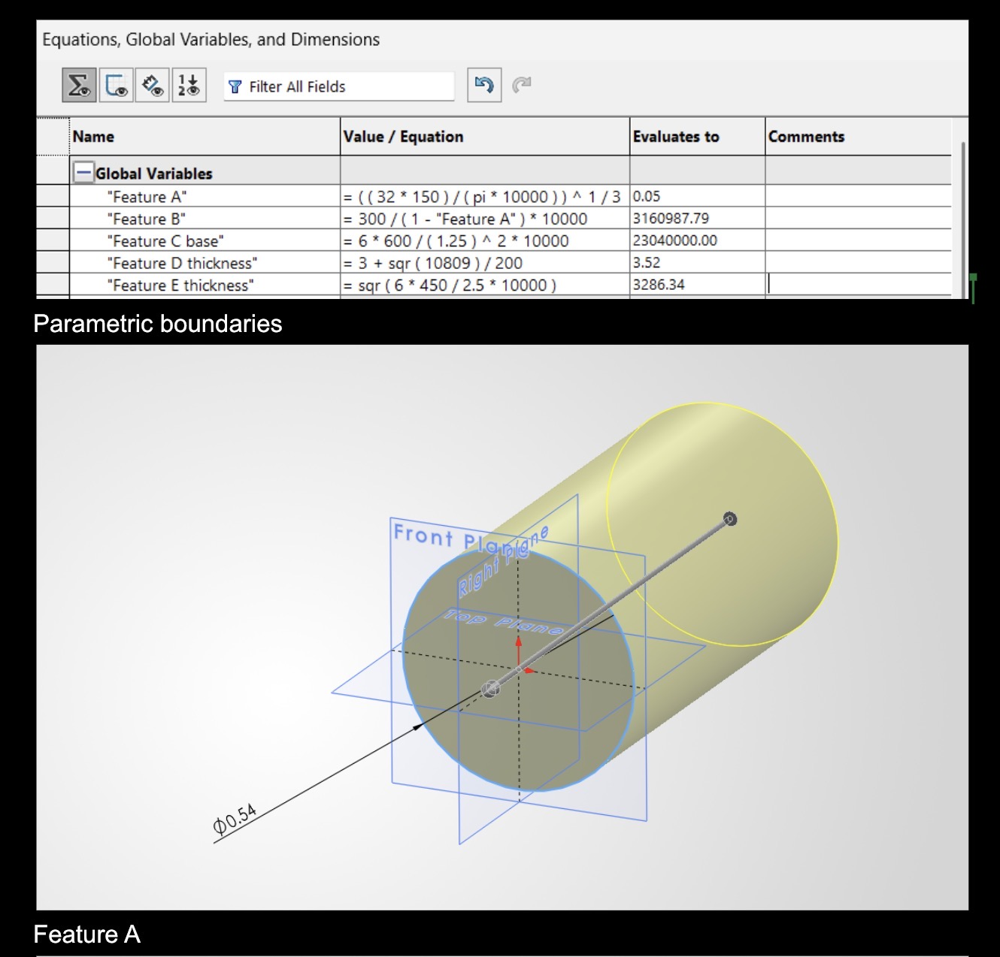
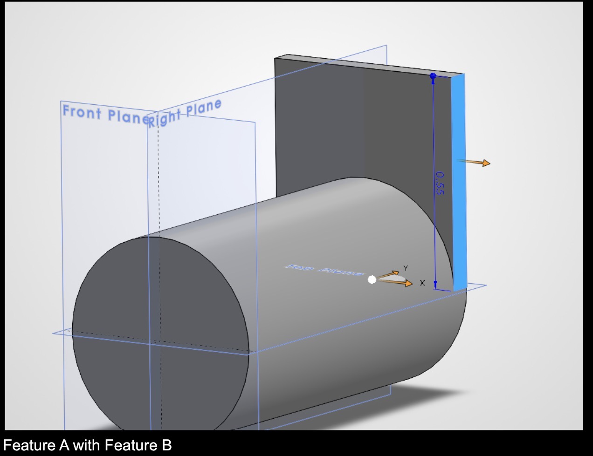
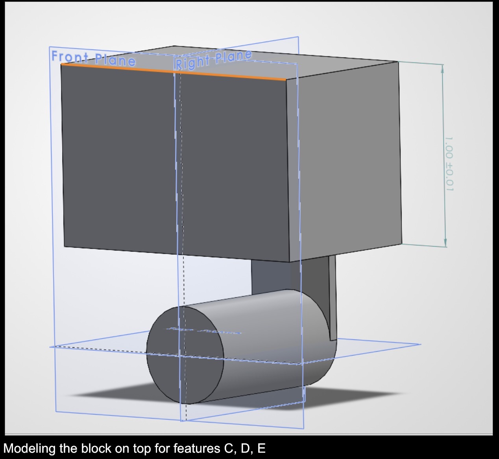
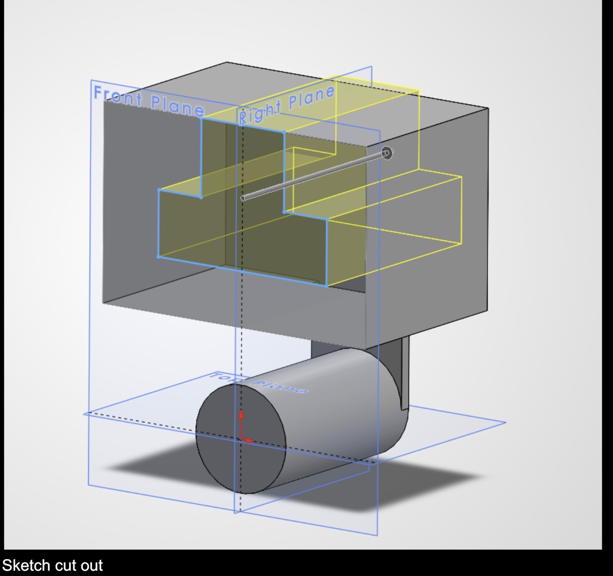
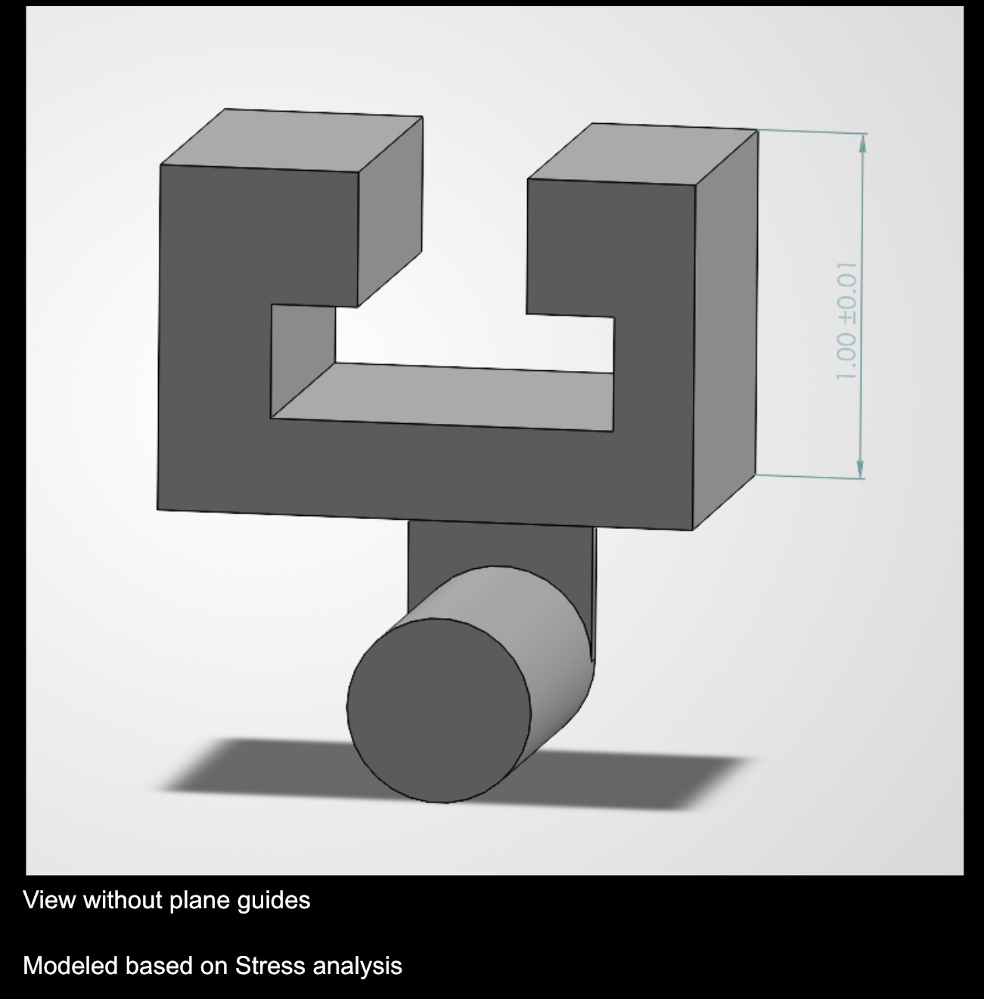
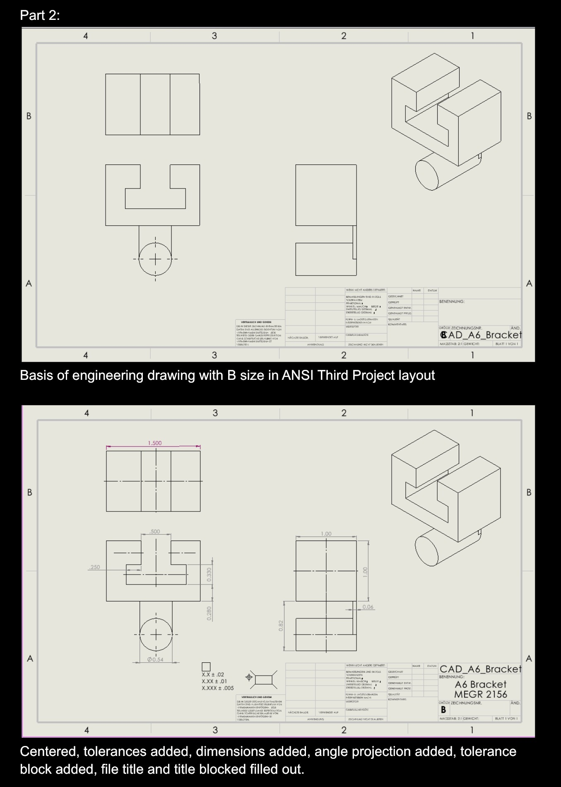

# A6 – Bracket Drawing

## **Objective**  
The objective of this assignment is to improve and continue upon last week's assignment (A5) with extensive detail in CAD with parametric design. We are asked to generate a comprehensive solid model and a multi-view engineering drawing that accurately represents your designed bracket, incoming all features to ensure both strength and stiffness requirements are met. Lastly, we are asked to detail engineering lessons learned during this assignment.  

## **Analyze**  
To see hand calculations comparing purpose design of Stress and Strain, please refer to Assignment > A5.  
  
  
  
  
  
  
The analytical equation I used in my parametric design for this bracket was Stress. I used stress to drive feature A as it would have the most load and direct stress from the force applied downward of the strap. I expressed that equation directly in CAD by setting my parameters for allowable stress and other limiting factors like the force applied and solved for my dimension for diameter of Feature A that way. Like this, "Thickness = sqrt((6 * F * L) / (Width * Sigma_allow))" I solved it on paper first, but ultimately to save time, I typed in the values I solved by hand to allow me to streamline the process of getting this assignment done quicker as I was limited on time during the course of this week. I had to change some minor calculations that did not impede on the model itself, but were easily solved by hand and readjusted to better fit the tolerances asked of by the assignment, drawing, and situation at hand.  

## **Decide**  
I applied a tighter tolerance to the dimensions of the T-bracket because of its purpose as a slide fit, most importantly was the height of feature C in my opinion has the biggest impact and need for a tight tolerance because it acts as a clamping force sandwiching the T-bar in between the upper and lower bracket. For the rest of the drawing I chose medium dimension tolerance (.02 decimal places) to maintain a precise and accurate vision for my model. Additionally the part is very small so therefore the tighter the tolerance given the better the practicality and functionality that this device will have given it’s purpose in the real world.  

## **Communicate**  
A couple of engineering lessons I learned over the course of both of these assignments during the past 2 weeks was to spend more time thinking about how precise my calculations need to be as well as sketching with accurate parameters to allow myself to naturally second guess and give myself time to come to right conclusion as well as completing right according to the instructions the first time around. I spent about 4 hours on this assignment between completing A5 and starting this assignment. This week I attempted to dedicate more time to having a better buffer of time between when I start and submit the assignment to eliminate last minute stress. Lastly, the last engineering lesson I learned was to not install CAD software overseas because the drawing language by default might be set to the language of the country you were staying in. My drawing language has defaulted to German, and I will have to fix it, but fortunately I speak German so this won’t be an issue.  

CAD Part: <a href="CAD_A6_Bracket.SLDPRT" download>Download SolidWorks Part</a>  
CAD Drawing: <a href="CAD_A6_Bracket.SLDPRT" download>Download SolidWorks Drawing</a>  
  
